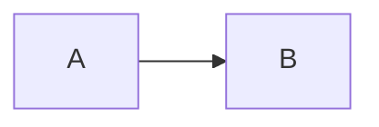

# Regression Document

Introductory paragraph with **bold**, *italic*, `inline code`, and a [link](https://example.com).

> [!NOTE]
> Standard alert body stays inside its container.

[!WARNING][Custom warning] Toy Box shorthand body stays inside its container.

## Tasks

- [ ] Pending task
- [x] Completed task

## Table

| Language | Example |
| --- | --- |
| PHP | `echo 1;` |
| SQL | `SELECT 1;` |

```php
<?php echo "hello";
```

```bash
echo "$HOME"
```

```json
{"ready": true}
```

```sql
SELECT * FROM users;
```

```unknown-language
plain fallback
```



---

### Final heading

Final paragraph.
